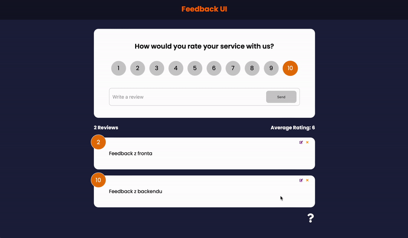

# 📝 React Feedback App

Feedback app that allows users to add, update and delete feedback using mock REST api with json-server.
While working on it with https://github.com/bradtraversy it helped me learn fundamentals of React like: 

  Components,
  JSX, 
  Props (proptypes, defaultprops), 
  State (Component & App Level), 
  Styling, 
  Handling Events, 
  Lists & Keys, 
  Forms, 
  Context API, 
  HTTP Requests, 
  
  ## Preview
 
 
 ## Usage

### Install dependencies

## `npm install`

### Run

## `npm run dev`
This will run JSON-server on port :5000 and React on port :3000

